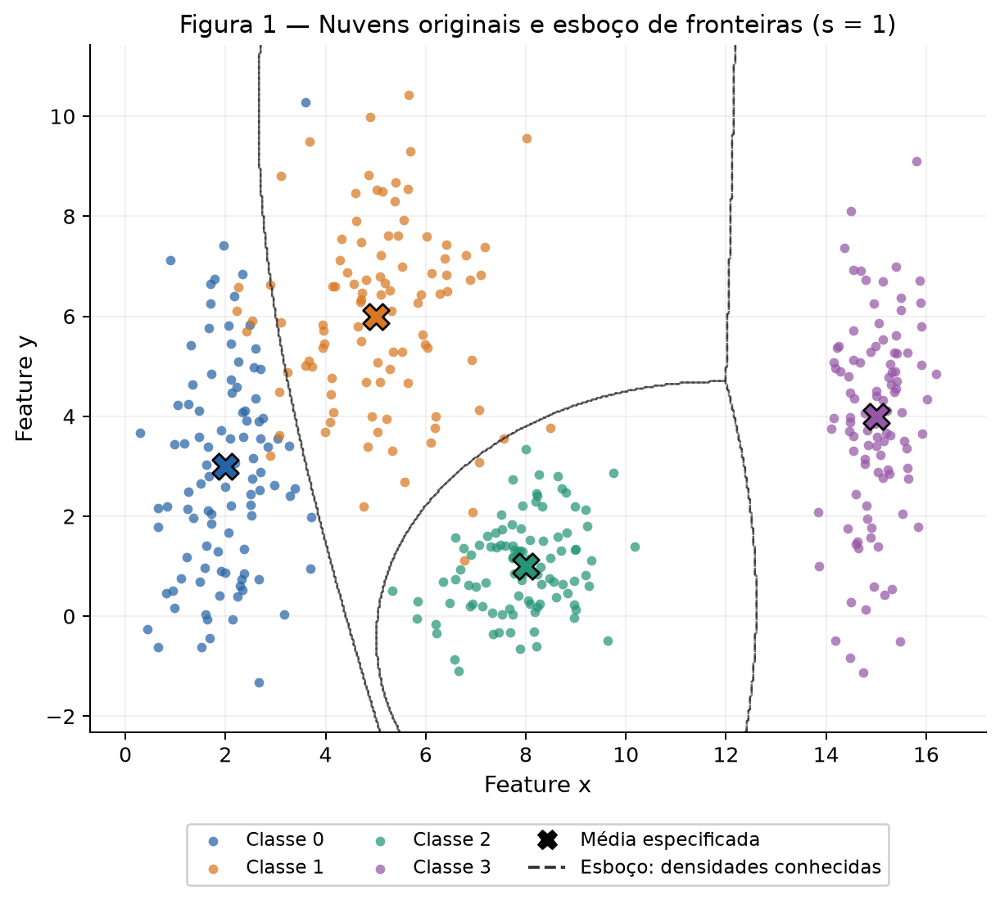
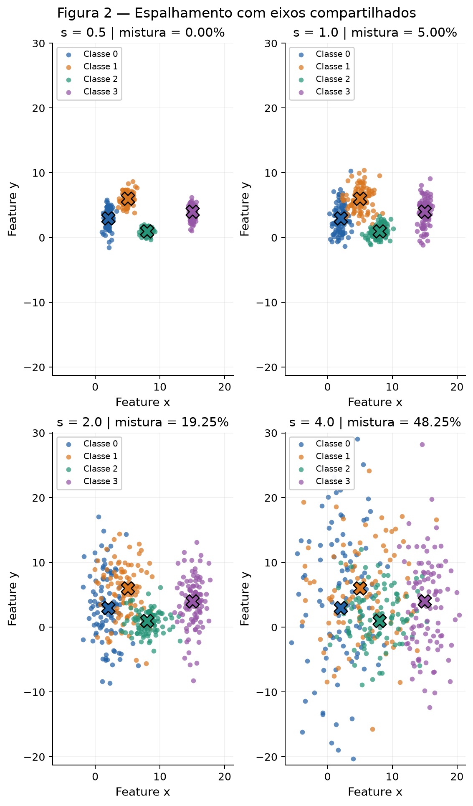
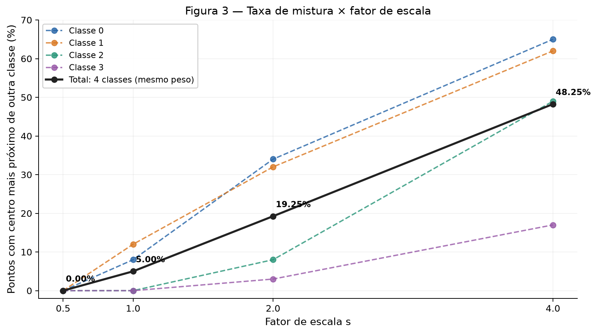
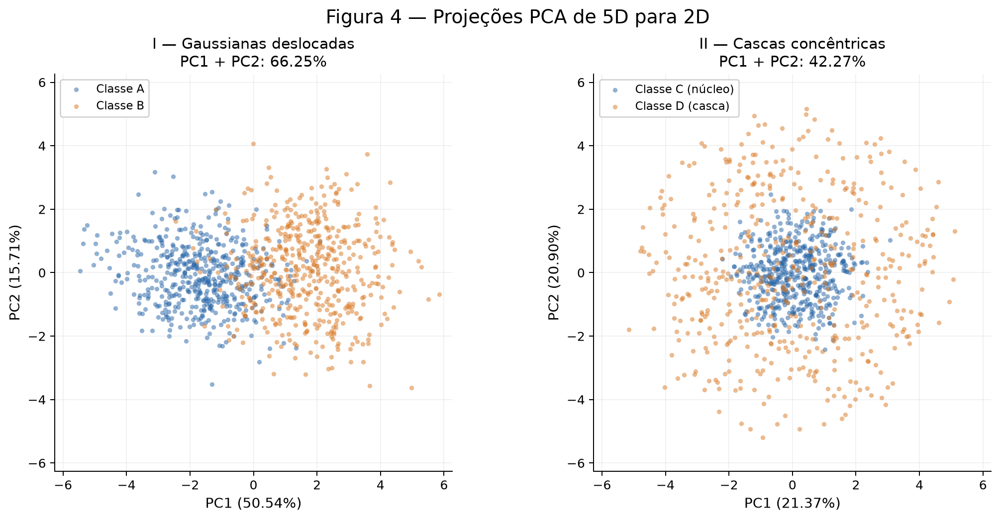
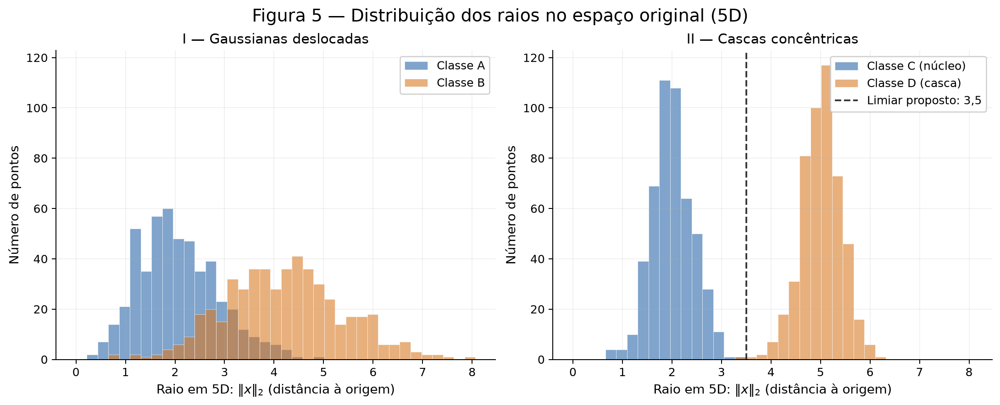
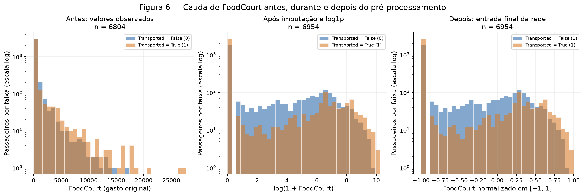

# Preparação e análise de dados para redes neurais

**Atividade 1 — Data | Espalhamento, geometria e pré-processamento**

Este relatório compara nuvens gaussianas em 2D, duas estruturas de classes em 5D
e a preparação do Spaceship Titanic para uma rede com ativação `tanh`.
Nenhum modelo preditivo é treinado: as fronteiras desenhadas e as regras de
comparação são calculadas diretamente a partir da geometria e dos parâmetros dados.

**Reprodutibilidade.** Execute `python docs/exercises/data/code/analise.py` da raiz
do repositório após instalar `requirements.txt`. O script executa os blocos na ordem;
o notebook complementar pode ser executado em um kernel novo.
Há um único `rng = np.random.default_rng(42)`, compartilhado por todas as gerações
e pelo split. A PCA usa SVD completa, determinística. O arquivo `data/train.csv`
acompanha o projeto; seu hash é conferido antes da leitura. As bibliotecas científicas
são exclusivamente as permitidas; os utilitários Jupyter servem apenas para montar
o notebook e exportar este relatório. Os resultados abaixo foram calculados, e os
valores também estão escritos nas análises e no resumo final.

!!! info "Uso de IA declarado"
    OpenAI Codex na implementação, na geração das figuras, na redação das análises e na organização do site. Código executado e resultados verificados.

[Baixar código executável](code/analise.py){ .md-button } [Notebook executado](code/relatorio.ipynb){ .md-button }

O código abaixo é incluído do arquivo versionado, sem cópias independentes coladas na página. Instruções de reprodução estão no [README do repositório](https://github.com/gubscruz/ann-dl#reproduzir-a-entrega).

??? example "Código executado — bloco 01"

    ```python title="code/analise.py"
    --8<-- "docs/exercises/data/code/analise.py:bloco_01"
    ```

## Exercício 1

### A — Gere as nuvens

Cada classe contém **100 pontos**, totalizando **400 amostras e duas features**.
As duas coordenadas são independentes dentro de cada gaussiana: suas covariâncias
são diagonais, com os quadrados dos desvios fornecidos. Os centros marcados na
Figura 1 são as **médias populacionais especificadas**, que não se confundem com
as médias amostrais. O esboço de fronteiras pedido em C aparece na própria figura.

| Classe | Média | Desvios padrão |
| --- | --- | --- |
| 0 | [2, 3] | [0,8; 2,5] |
| 1 | [5, 6] | [1,2; 1,9] |
| 2 | [8, 1] | [0,9; 0,9] |
| 3 | [15, 4] | [0,5; 2,0] |

??? example "Código executado — bloco 02"

    ```python title="code/analise.py"
    --8<-- "docs/exercises/data/code/analise.py:bloco_02"
    ```



*Figura 1. Nuvens originais, centros especificados e esboço de fronteiras; nenhuma rede treinada.*

### B — Mais ou menos espalhado

Construí **quatro datasets**, cada um com as quatro classes e 400 pontos.
O dataset de $s=1$ é exatamente o do item A. Para $s=0,5$, $s=2$ e $s=4$,
sorteei novas amostras, nessa ordem, continuando o mesmo `rng`; as médias
permanecem fixas e todos os desvios são multiplicados por $s$.
Assim, a comparação também contém a variabilidade das amostragens independentes.

A taxa de mistura compara distâncias euclidianas às **quatro médias especificadas**:
$m(s)=N^{-1}\sum_n 1[\arg\min_k\|x_n-\mu_k\|\ne y_n]$.
Isso é uma medida geométrica, sem estimar parâmetros ou treinar um classificador.

??? example "Código executado — bloco 03"

    ```python title="code/analise.py"
    --8<-- "docs/exercises/data/code/analise.py:bloco_03"
    ```



*Figura 2. As mesmas quatro classes em quatro escalas, com limites de eixos compartilhados.*



*Figura 3. Taxa de mistura total e por classe em função do fator de escala.*

A razão usa os parâmetros populacionais: $r_{ij}=\|\mu_i-\mu_j\|/(\bar\sigma_i+\bar\sigma_j)$, com $\bar\sigma_k=(\sigma_{k,x}+\sigma_{k,y})/2$.

| Par | Distância dos centros | Soma dos desvios médios | r_ij em s=1 |
| --- | --- | --- | --- |
| (0, 1) | 4,2426 | 3,2000 | 1,3258 |
| (0, 2) | 6,3246 | 2,5500 | 2,4802 |
| (0, 3) | 13,0384 | 2,9000 | 4,4960 |
| (1, 2) | 5,8310 | 2,4500 | 2,3800 |
| (1, 3) | 10,1980 | 2,8000 | 3,6422 |
| (2, 3) | 7,6158 | 2,1500 | 3,5422 |

O menor valor é **1,3258, no par (0, 1)**, em $s=1$.
Como o denominador é multiplicado por $s$, o mínimo em $s=2$ vale
**0,6629**, sem nova geração ou estimação.

As taxas de mistura foram:

| s | Pontos misturados / 400 | Taxa de mistura (%) |
| --- | --- | --- |
| 0,50 | 0 | 0,00 |
| 1,00 | 20 | 5,00 |
| 2,00 | 77 | 19,25 |
| 4,00 | 193 | 48,25 |

Em texto: **0,00% em s=0,5; 5,00%
em s=1; 19,25% em s=2; e 48,25% em s=4**.
As linhas coloridas da Figura 3 decompõem a mesma medida por classe, enquanto
a linha preta é a taxa total solicitada.

**Verificação geométrica da separabilidade.** Uma taxa de mistura positiva, sozinha,
não prova que toda reta falha: a regra do centro mais próximo fixa fronteiras
particulares. Para decidir sobre a amostra 2D, calculo os **fechos convexos**
dos pontos de cada classe e verifico sua interseção. Dois conjuntos finitos
admitem separação estrita por uma reta se, e somente se, seus fechos convexos
são disjuntos. O código usa o algoritmo da cadeia monótona e as projeções nas
normais às arestas dos polígonos, apenas com NumPy, sem treinar modelos.

??? example "Código executado — bloco 04"

    ```python title="code/analise.py"
    --8<-- "docs/exercises/data/code/analise.py:bloco_04"
    ```

| s | Pares com fechos sobrepostos | Todos os pares separáveis por retas? |
| --- | --- | --- |
| 0,5 | Nenhum | Sim |
| 1,0 | [(0, 1), (1, 2)] | Não |
| 2,0 | [(0, 1), (0, 2), (1, 2), (2, 3)] | Não |
| 4,0 | [(0, 1), (0, 2), (1, 2), (1, 3), (2, 3)] | Não |

**Nas amostras geradas, a primeira escala testada com perda de separabilidade
linear entre classes é s=1,0**, quando os fechos dos pares
[(0, 1), (1, 2)] se sobrepõem. Nesse ponto,
o menor $r_{ij}$ é **1,3258**.
Esse número resume distância e dispersão, mas não constitui um limiar universal
de separabilidade: não incorpora completamente a direção do espalhamento nem
os extremos de uma amostra finita.

Na distribuição populacional, gaussianas não degeneradas têm suporte em todo
o plano e já se sobrepõem para **qualquer s > 0**. Portanto, não existe uma
escala positiva em que uma separação populacional perfeita deixe de existir:
ela nunca foi perfeita. A resposta sobre a primeira escala refere-se aos
datasets finitos observados e à separação estrita entre os pares de classes.

### C — Análise

Em $s=1$, a classe 0 é alongada verticalmente e se sobrepõe principalmente à
classe 1. A classe 2 é mais compacta e fica à direita e abaixo da classe 1;
a classe 3 é estreita em x e ocupa uma região bem afastada à direita.
A mistura total pelo centro mais próximo é **5,00%**,
e os pares com fechos convexos sobrepostos são **[(0, 1), (1, 2)]**.

Uma única reta divide o plano em apenas dois semiplanos e não produz quatro
regiões de decisão para quatro rótulos. Um conjunto de discriminantes lineares
pode representar uma boa aproximação das regiões mais densas, mas não separa
perfeitamente esta amostra: há pelo menos um par sem reta separadora.
Isso se refere a fronteiras lineares entre classes; uma combinação arbitrária
de muitas retas formando pequenas regiões já é uma regra não linear por partes
e poderia memorizar pontos distintos.

O esboço tracejado da Figura 1 usa as densidades gaussianas conhecidas, com
prior de 1/4 por classe. Como as covariâncias são diferentes, as fronteiras de
igual densidade são, em geral, **curvas quadráticas**: uma rede com não linearidades
poderia aproximá-las. Nenhuma rede foi ajustada, e esse desenho não é usado para
calcular a taxa de mistura, que continua sendo a comparação aos centros.

Ao aumentar $s$, as regiões de sobreposição com probabilidade relevante aumentam,
o menor $r_{ij}$ cai como $1/s$ e há maior ambiguidade do rótulo dado um ponto.
Uma rede mais flexível pode reduzir erro por fronteira inadequada ou até memorizar
a amostra, mas não elimina o **erro esperado irredutível** causado pela sobreposição
das distribuições. Não há um conjunto de pontos em que ela obrigatoriamente erre
sempre; há regiões em que nenhuma regra determinística acerta todos os possíveis
rótulos gerados. A taxa de mistura observada não é uma estimativa direta desse
erro ótimo, pois usa uma regra geométrica específica.

## Exercício 2

### A — Dataset I: gaussianas deslocadas

Gerei **500 amostras da classe A e 500 da classe B em cinco dimensões**, usando
as duas matrizes de covariância exatamente como no enunciado. Conferi que elas
são definidas positivas antes do sorteio. A primeira tem correlação positiva
entre as duas primeiras features; a segunda tem covariância −0,7 entre elas
e variâncias marginais de 1,5.

??? example "Código executado — bloco 05"

    ```python title="code/analise.py"
    --8<-- "docs/exercises/data/code/analise.py:bloco_05"
    ```

### B — Dataset II: cascas concêntricas

Para cada classe, sorteei 500 vetores normais isotrópicos em $\mathbb{R}^5$ e
normalizei suas normas. Pela simetria rotacional, isso fornece direções uniformes
na esfera unitária. Sorteio o raio independentemente da direção e multiplico
ambos: $x=\rho u$. Os parâmetros dos raios são **média 2,0 e desvio 0,4** para C
e **média 5,0 e desvio 0,4** para D. Embora chamada de núcleo, C se concentra
perto do raio 2; não é uma distribuição uniforme no interior de uma bola.

??? example "Código executado — bloco 06"

    ```python title="code/analise.py"
    --8<-- "docs/exercises/data/code/analise.py:bloco_06"
    ```

### C — Visualize e compare

Ajustei uma PCA independente em cada dataset de 1.000 pontos, com centralização
automática e **sem padronizar as features**: todas estão na mesma unidade e as
diferenças de variância fazem parte do experimento. `svd_solver="full"` evita
aleatoriedade adicional. As distâncias entre centros são calculadas pelas
**médias amostrais em 5D**; apresento também as distâncias populacionais para
explicitar a flutuação da amostragem.

??? example "Código executado — bloco 07"

    ```python title="code/analise.py"
    --8<-- "docs/exercises/data/code/analise.py:bloco_07"
    ```



*Figura 4. Projeções PCA em duas dimensões dos dois datasets originalmente em 5D.*



*Figura 5. Histogramas sobrepostos dos raios medidos no espaço original de cinco dimensões.*

| Dataset | Distância amostral (5D) | Distância populacional | PC1 (%) | PC2 (%) | PC1 + PC2 (%) |
| --- | --- | --- | --- | --- | --- |
| I | 3,3988 | 3,3541 | 50,5397 | 15,7055 | 66,2453 |
| II | 0,2215 | 0,0000 | 21,3742 | 20,8998 | 42,2740 |

No Dataset I, **PC1 explica 50,5397%** e
**PC2 explica 15,7055%**, totalizando
**66,2453%**. No Dataset II, os valores são
**21,3742%**, **20,8998%** e
**42,2740%**, respectivamente.

As distâncias amostrais entre centros em 5D são **3,3988 no Dataset I**
e **0,2215 no Dataset II**. Pelos parâmetros populacionais, elas são
$1,5\sqrt{5}=$ **3,3541** e **0**, respectivamente;
o pequeno deslocamento entre C e D é efeito do tamanho finito da amostra.

**A projeção 2D preserva melhor a informação útil no Dataset I**, neste experimento:
o deslocamento das médias contribui para uma direção de grande variância,
parcialmente preservada pela PCA. No Dataset II, a informação discriminante está
no raio em todas as cinco coordenadas, enquanto a orientação é isotrópica;
descartar três coordenadas permite que pontos da casca externa se projetem perto
do núcleo. A maior variância explicada, sozinha, não provaria melhor classificação:
a conclusão combina essa medida, o deslocamento dos centros e a geometria observada.

### D — Análise

No Dataset II, centros quase coincidentes junto com raios bem distintos indicam
que **a distância à origem discrimina as classes, e a direção não**. Um hiperplano
$w^Tx+b=0$ seleciona lados do espaço e não consegue colocar um núcleo esférico
inteiro de um lado e uma casca que o envolve do outro. Pela simetria, os pontos
$ru$ e $-ru$ de uma mesma esfera aparecem em lados opostos de um plano que passa
pelo centro; deslocar o plano tampouco cria uma região interna fechada.
Equivalentemente, o fecho convexo da casca contém o núcleo. Mais observações
preenchem as direções e não removem essa obstrução geométrica.

Centros coincidentes, isoladamente, não seriam uma demonstração suficiente para
uma amostra qualquer. Aqui a conclusão usa também a **simetria radial e a estrutura
concêntrica**. Além disso, os raios normais têm caudas infinitas: mesmo uma fronteira
não linear não promete erro populacional exatamente zero. Isso é diferente da
impossibilidade estrutural de resolver as cascas com um único hiperplano.

Uma projeção linear 2D em que há mistura **não prova inseparabilidade no espaço
original**: ela descarta informações, podendo sobrepor pontos originalmente
distintos. O próprio Dataset II apresenta mistura visual na Figura 4 e separação
radial nítida na Figura 5. Uma função simples que usa essa informação é

$$g(x)=\sum_{i=1}^{5}x_i^2-3,5^2=\sum_{i=1}^{5}x_i^2-12,25.$$

Atribuo C se $g(x)<0$ e D se $g(x)\geq0$. O raio 3,5 é o ponto médio entre os
raios médios 2 e 5 fornecidos pelo enunciado; não foi ajustado aos dados.
A função é quadrática nas entradas originais, embora uma comparação linear
seja suficiente **depois** de criar a feature não linear $z=\sum_i x_i^2$.

??? example "Código executado — bloco 08"

    ```python title="code/analise.py"
    --8<-- "docs/exercises/data/code/analise.py:bloco_08"
    ```

| Classe | Raio mínimo | Raio médio | Raio máximo |
| --- | --- | --- | --- |
| A | 0,2945 | 2,0666 | 4,9722 |
| B | 0,6679 | 4,2077 | 7,9640 |
| C | 0,7522 | 2,0039 | 3,2796 |
| D | 3,4449 | 5,0175 | 6,2403 |

A regra radial com limiar 3,5 cometeu **1 erros em 1.000 pontos**
do Dataset II (**0,10%**).
Este é um diagnóstico geométrico da amostra gerada, sem treinamento ou avaliação
de generalização. A distância entre centros não capta essa informação: apesar
de valer apenas **0,2215**, as classes se distinguem pelo raio.

**Uma função que separa todos os pontos desta amostra** é
$g_{amostra}(x)=\sum_i x_i^2-11$: retorna C para valor negativo e D caso contrário.
Com ela, há **0 erros em 1.000 pontos**. Isso é possível
porque o maior raio de C é **3,2796** e o menor raio de D é
**3,4449**; $\sqrt{11}\approx3,3166$ fica dentro desse vão.
O limiar 11 foi escolhido para ilustrar o vão observado, ao passo que 3,5 foi
derivado dos parâmetros do enunciado. A primeira demonstração é específica da
amostra e não fornece uma garantia para novos pontos; não houve treinamento
de rede ou de qualquer modelo estimado por algoritmo.

## Exercício 3

### A — Conheça os dados

O **Spaceship Titanic** é uma tarefa de classificação binária: `Transported=True`
indica que o passageiro foi transportado para outra dimensão durante o encontro
da nave com uma anomalia. As demais colunas descrevem o passageiro e seus gastos.
Fonte do objetivo e do dicionário de dados:
[Kaggle — Spaceship Titanic](https://www.kaggle.com/competitions/spaceship-titanic/data).

O download direto do Kaggle pede autenticação e aceite das regras. Para executar
esta atividade, usei uma
[cópia pública do train.csv](https://github.com/You-sha/Spaceship-Titanic/blob/main/train.csv),
conferida byte a byte por SHA-256 contra
[uma segunda cópia pública](https://github.com/AmirFARES/Kaggle-Spaceship-Titanic/blob/main/data/train.csv).
Os hashes são iguais. Trata-se do arquivo **rotulado `train.csv`**; o `test.csv`
da competição não é utilizado. O teste deste relatório é reservado desse arquivo
rotulado, conforme o split 80/20 solicitado.

As features originais se dividem assim:

| Tipo | Colunas | Tratamento |
| --- | --- | --- |
| Numéricas | `Age`, `RoomService`, `FoodCourt`, `ShoppingMall`, `Spa`, `VRDeck` | Imputação e escala; log nos gastos |
| Categóricas | `HomePlanet`, `CryoSleep`, `Destination`, `VIP` | Imputação e one-hot |
| Categóricas estruturadas / identificadores / texto | `Cabin`, `PassengerId`, `Name` | Descartadas, conforme o enunciado |
| Alvo binário | `Transported` | Separado das features; False=0 e True=1 |

As estatísticas descritivas do item A são do arquivo inteiro e excluem faltantes
em cada coluna. Elas atendem à descrição pedida e **não alimentam as transformações**.
Para deixar a separação explícita, os índices de treino e teste já são reservados
logo após a leitura, antes dessas estatísticas; o item B detalha o procedimento.

??? example "Código executado — bloco 09"

    ```python title="code/analise.py"
    --8<-- "docs/exercises/data/code/analise.py:bloco_09"
    ```

O arquivo contém **8693 passageiros** e **14 colunas**, sendo 13 features
originais e um alvo. A classe positiva tem **4378 passageiros
(50,3624%)**, e a negativa tem
**4315 (49,6376%)**.
Logo, o alvo está aproximadamente balanceado.

| Transported | Contagem | Percentual (%) |
| --- | --- | --- |
| False (0) | 4315 | 49,6376 |
| True (1) | 4378 | 50,3624 |

**Valores faltantes, por coluna (arquivo inteiro):**

| Coluna | Faltantes | Percentual (%) |
| --- | --- | --- |
| PassengerId | 0 | 0,0000 |
| HomePlanet | 201 | 2,3122 |
| CryoSleep | 217 | 2,4963 |
| Cabin | 199 | 2,2892 |
| Destination | 182 | 2,0936 |
| Age | 179 | 2,0591 |
| VIP | 203 | 2,3352 |
| RoomService | 181 | 2,0821 |
| FoodCourt | 183 | 2,1051 |
| ShoppingMall | 208 | 2,3927 |
| Spa | 183 | 2,1051 |
| VRDeck | 188 | 2,1627 |
| Name | 200 | 2,3007 |
| Transported | 0 | 0,0000 |

Há **2324 células faltantes** no arquivo; o alvo tem **0**.

**Gastos antes de qualquer transformação (arquivo inteiro; NaN ignorado):**

| Coluna | Média | Mediana | Máximo |
| --- | --- | --- | --- |
| RoomService | 224,69 | 0,00 | 14327,00 |
| FoodCourt | 458,08 | 0,00 | 29813,00 |
| ShoppingMall | 173,73 | 0,00 | 23492,00 |
| Spa | 311,14 | 0,00 | 22408,00 |
| VRDeck | 304,85 | 0,00 | 24133,00 |

As cinco medianas são **zero**, enquanto as médias são positivas e os máximos
ficam muito acima delas. Isso indica muitos passageiros sem gasto e uma minoria
com gastos elevados: há forte assimetria à direita e grande dispersão na cauda.
Em `FoodCourt`, por exemplo, média = **458,08**,
mediana = **0,00** e máximo =
**29813,00**. A média é puxada pelos gastos altos;
não representa o passageiro típico. Uso “cauda pesada” no sentido exploratório
do enunciado, sem afirmar uma família probabilística específica.

### B — Separe antes de transformar

O split implementado acima embaralha separadamente os índices de cada classe
com o mesmo `rng`, reserva aproximadamente 20% de cada uma para teste e embaralha
os dois conjuntos resultantes. O total de teste é arredondado para cima; as cotas
por classe usam os maiores restos, mantendo as proporções tão próximas quanto
possível. Não se usa um segundo gerador nem `train_test_split`.

A separação precede a imputação e o escalonamento porque medianas, extremos e
categorias aprendidas no arquivo inteiro levariam informação do teste para o
treino. Ajustar os transformadores exclusivamente no treino mantém o teste como
uma aproximação de dados ainda não vistos, à qual se aplicam os mesmos parâmetros.
As estatísticas globais de A são somente descritivas, e nunca são reutilizadas
nos objetos de pré-processamento.

??? example "Código executado — bloco 10"

    ```python title="code/analise.py"
    --8<-- "docs/exercises/data/code/analise.py:bloco_10"
    ```

| Conjunto | Amostras | False (0) | True (1) | Positivos (%) |
| --- | --- | --- | --- | --- |
| Treino | 6954 | 3452 | 3502 | 50,3595 |
| Teste | 1739 | 863 | 876 | 50,3738 |

São **6954 amostras de treino** e **1739 de teste**,
aproximadamente 80/20. A fração positiva é **50,3595% no
treino** e **50,3738% no teste**.
**No treino, antes de imputar ou transformar, `FoodCourt` tem média
462,1448 e mediana 0,0000**,
calculadas sobre valores observados. Estes são os números retomados no item 11
do resumo; diferem da descrição do arquivo completo apresentada em A.

### C — Pré-processe

**Faltantes numéricos.** Uso a mediana de cada coluna, aprendida somente no treino.
Ela resiste à influência dos gastos extremos; para os gastos a mediana de treino
é zero, e para `Age` preserva um valor central da distribuição observada.
Isso não prova que um gasto desconhecido era zero: é uma simplificação de imputação.

**Faltantes categóricos.** Uso a categoria explícita `Ausente`, preservando a
distinção entre não informado e categorias reais. A conversão de booleanos em
texto é apenas uma uniformização de tipo, sem estatística aprendida.
O imputador e o one-hot são ajustados no treino. `handle_unknown="ignore"`
representa uma categoria inédita no teste por zeros no bloco daquela feature,
sem criar nova coluna e sem refazer o ajuste. Categorias não são inferidas do teste.

**Engenharia de features.** Descarto `Cabin`, `Name` e `PassengerId` pela seleção
explícita das colunas permitidas. Depois de imputar os cinco gastos em unidades
originais, crio `TotalSpend` como sua soma; assim não somo gastos logarítmicos nem
confundo a soma parcial de valores observados com uma soma completa.

**Cauda pesada.** Aplico `np.log1p` aos cinco gastos e também a `TotalSpend`.
A transformação mantém zero em zero, comprime grandes valores e conserva a ordem,
sem aprender estatísticas. Isso reduz a dominância dos extremos antes da escala
e ajuda a evitar pré-ativações excessivas, nas quais `tanh` satura e seu gradiente
fica pequeno. O efeito em `FoodCourt` aparece na Figura 6 do item D.

**Escalonamento.** Escolho `MinMaxScaler(feature_range=(-1, 1), clip=True)` para
as sete features numéricas: `Age`, os cinco gastos em log e `TotalSpend` em log.
O mínimo e máximo de cada coluna vêm somente do treino. `clip=True` limita a
−1 ou 1 valores de teste que ultrapassem os extremos de treino, sem usar os
extremos do teste para ajustar a escala; reporto abaixo quantos são truncados.
One-hot permanece em 0/1, já contido no intervalo solicitado.

O intervalo de saída de `tanh` não impõe uma restrição matemática às entradas;
a escala escolhida é uma medida de condicionamento. Ela não garante ausência
de saturação, pois as pré-ativações também dependem de pesos e vieses.

??? example "Código executado — bloco 11"

    ```python title="code/analise.py"
    --8<-- "docs/exercises/data/code/analise.py:bloco_11"
    ```

**Medianas usadas na imputação numérica:**

| Coluna | Mediana aprendida no treino |
| --- | --- |
| Age | 27,00 |
| RoomService | 0,00 |
| FoodCourt | 0,00 |
| ShoppingMall | 0,00 |
| Spa | 0,00 |
| VRDeck | 0,00 |

**Categorias e dimensões aprendidas exclusivamente no treino:**

| Feature | Categorias vistas no treino | Número de colunas one-hot |
| --- | --- | --- |
| HomePlanet | Ausente, Earth, Europa, Mars | 4 |
| CryoSleep | Ausente, False, True | 3 |
| Destination | 55 Cancri e, Ausente, PSO J318.5-22, TRAPPIST-1e | 4 |
| VIP | Ausente, False, True | 3 |

No teste reservado, há **0 categorias
inéditas** entre as quatro features. O código também verifica uma entrada artificial
`Planeta_inedito`: o bloco de `HomePlanet` é convertido em zeros, mantendo o mesmo
número de features. Esse exemplo verifica o tratamento de uma categoria nova;
não é incluído na matriz de teste.

**Intervalos depois do escalonamento e da concatenação:**

| Conjunto | Mínimo numérico | Máximo numérico | Mínimo da matriz final | Máximo da matriz final |
| --- | --- | --- | --- | --- |
| Treino | -1,000000 | 1,000000 | -1,000000 | 1,000000 |
| Teste | -1,000000 | 1,000000 | -1,000000 | 1,000000 |

As features numéricas e as matrizes completas têm **mínimo
-1,000000 e máximo 1,000000 no treino**;
no teste, **mínimo -1,000000 e máximo
1,000000**. O one-hot ocupa apenas 0 e 1.

Antes do clipping, o intervalo numérico do teste seria
**[-1,000000, 1,014209]**.
Foram truncadas **1 células numéricas** em
**1 passageiros de teste**, distribuídas assim:

| Coluna | Células do teste truncadas |
| --- | --- |
| Age | 0 |
| RoomService | 0 |
| FoodCourt | 1 |
| ShoppingMall | 0 |
| Spa | 0 |
| VRDeck | 0 |
| TotalSpend | 0 |

O truncamento torna o intervalo garantido, mas perde a distinção entre valores
que ultrapassam o mesmo extremo. O log reduz a influência da cauda antes desse
passo. A escolha e seus limites foram fixados sem ajustar parâmetros no teste.

### D — Verifique e visualize

A Figura 6 usa apenas passageiros do **treino**, coloridos por `Transported`.
O primeiro painel mostra os gastos observados, omitindo somente os NaN dessa
feature; o segundo mostra o efeito da imputação e do log; o terceiro mostra a
feature final após normalização. Os dois painéis posteriores incluem os valores
imputados. As contagens no eixo vertical usam escala logarítmica para tornar a
cauda visível, e isso está indicado no rótulo; a transformação `log1p` da feature
ocorre no eixo horizontal do painel intermediário.

??? example "Código executado — bloco 12"

    ```python title="code/analise.py"
    --8<-- "docs/exercises/data/code/analise.py:bloco_12"
    ```



*Figura 6. FoodCourt no treino: valores observados, após log1p e após normalização.*

| Conjunto | shape | NaN | Infinitos | Mínimo | Máximo |
| --- | --- | --- | --- | --- | --- |
| Treino | (6954, 21) | 0 | 0 | -1,000000 | 1,000000 |
| Teste | (1739, 21) | 0 | 0 | -1,000000 | 1,000000 |

**Checagens finais:** há **0 NaN e 0 infinitos** no treino e no teste.
O `shape` final é **(6954, 21) no treino** e
**(1739, 21) no teste**, com **7 features numéricas**
e **14 colunas one-hot**. Ambas as matrizes estão integralmente
em **[−1, 1]**, compatíveis com a escala de entrada escolhida para `tanh`.
Treino e teste têm as mesmas colunas e a mesma ordem; o alvo não está nas features.
Os testes também confirmaram índices disjuntos e parâmetros dos transformadores
iguais aos calculados exclusivamente no treino.

As decisões que mais afetariam o treinamento são o **log seguido da escala**,
pois gastos muito grandes poderiam dominar as combinações lineares e contribuir
para saturação de `tanh`, e a **codificação one-hot**, que evita impor uma ordem
numérica inexistente aos planetas ou destinos. A mediana e a categoria `Ausente`
permitem aproveitar linhas incompletas, mas introduzem hipóteses sobre os valores
desconhecidos; `TotalSpend` explicita o gasto agregado, embora seja redundante com
os gastos individuais antes do log. Separar antes dos ajustes protege a validade
de uma futura avaliação, e limitar os extremos do teste controla a escala ao
custo de perder informação além dos limites do treino. Sem treinar modelos,
essas são implicações esperadas das transformações, não ganhos de desempenho medidos.

??? example "Código executado — bloco 13"

    ```python title="code/analise.py"
    --8<-- "docs/exercises/data/code/analise.py:bloco_13"
    ```

## Resumo dos resultados

As distâncias dos itens 6 e 7 usam centros amostrais em 5D. O item 13 inclui o clipping do teste especificado em 3C.

| # | Item | Seu valor |
| --- | --- | --- |
| 1 | Taxa de mistura em s=0.5 | 0,00% (0/400) |
| 2 | Taxa de mistura em s=1.0 | 5,00% (20/400) |
| 3 | Taxa de mistura em s=2.0 | 19,25% (77/400) |
| 4 | Taxa de mistura em s=4.0 | 48,25% (193/400) |
| 5 | Menor r_ij em s=1.0 e qual é o par | 1,3258; par (0, 1) |
| 6 | Distância entre os centros — Dataset I | 3,3988 |
| 7 | Distância entre os centros — Dataset II | 0,2215 |
| 8 | Variância explicada PC1 + PC2 — Dataset I | 66,2453% |
| 9 | Variância explicada PC1 + PC2 — Dataset II | 42,2740% |
| 10 | Proporção da classe positiva em Transported | 0,503624 (50,3624%) |
| 11 | Média e mediana de FoodCourt no treino, antes de transformar | Média 462,1448; mediana 0,0000 |
| 12 | shape final da matriz de features de treino | (6954, 21) |
| 13 | Mínimo e máximo do treino e do teste após o escalonamento | Treino [-1,0, 1,0]; teste [-1,0, 1,0] |
